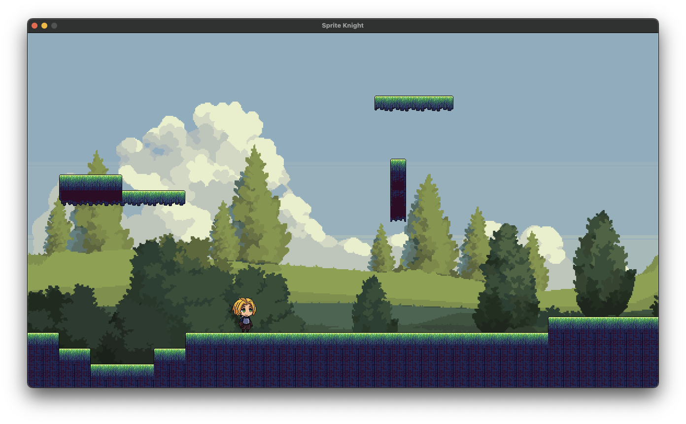

# 2D Sprite-based Game in Python

A simple 2D game developed using Python and Pygame. Control a
character, make it walk, run, and interact within a 2D
environment.



## Features

- **Character Movement**: Use arrow keys to move the character left
  or right.
- **Running Mechanic**: Hold the shift key while moving to make the
  character run.
- **Sprite Animation**: Smooth animations for walking and running using
  sprite sheets.
- **Easy Exit**: Press `Q` or `ESC` to exit the game anytime.

## Installation

1. **Clone the Repository**:

```bash
git clone https://github.com/thaapasa/python-sprite-game
```

2. **Navigate to the Directory**:
```bash
cd python-sprite-game
```

3. **Install Required Packages**:

Make sure you have Python and `pip` installed. Then, install the
required packages:

```bash
pip install -r requirements.txt
```

## Usage

Run the game using:

```bash
python game.py
```

## License

[MIT](./LICENSE)
